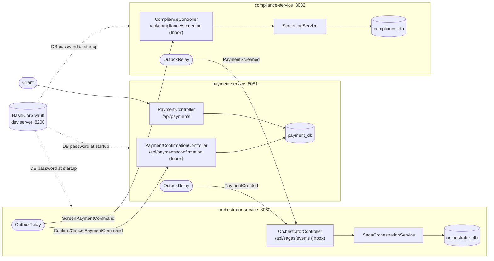
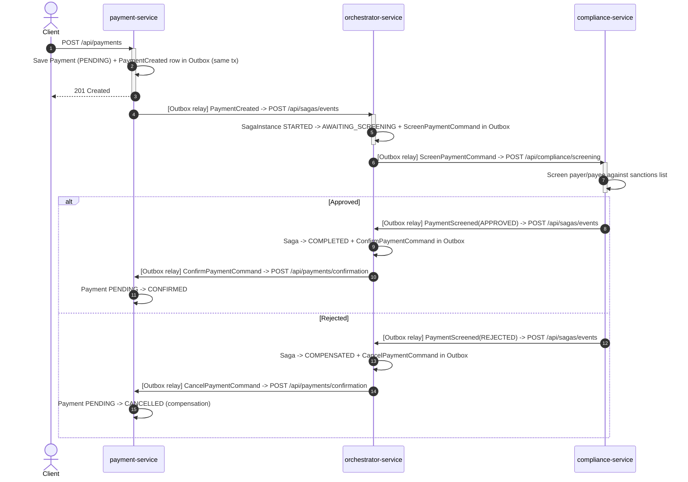
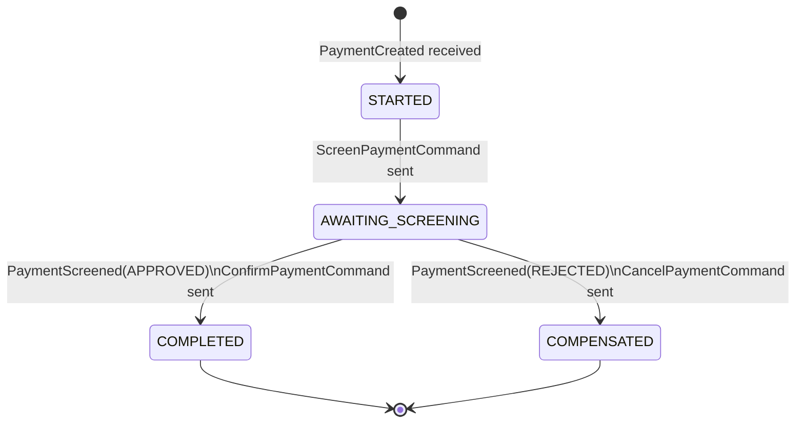
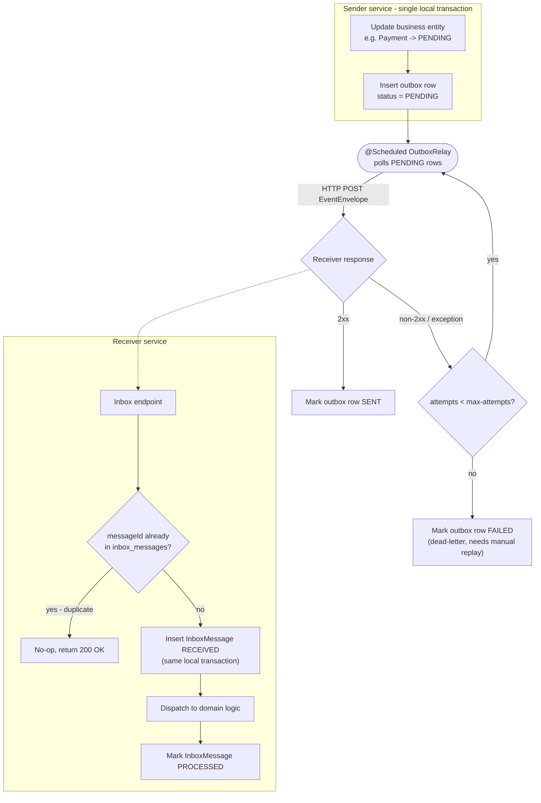

# payment-compliance-saga-orchestrator

Portfolio PoC: a **Payment + Compliance (AML/sanctions screening) saga**, orchestrated by a
hand-written Java saga orchestrator that talks to two independently deployable Spring Boot
microservices purely over **REST**, using the **transactional Outbox/Inbox pattern** for
reliable, idempotent, at-least-once messaging — **no message broker involved**.

This is intentionally *not* another "Step Functions calling DynamoDB" demo. The orchestrator is a
real microservice with its own database; `payment-service` and `compliance-service` are separate
deployable units with their own databases, and all cross-service communication happens over HTTP.

## Why this design

| Decision | Rationale |
|---|---|
| Custom orchestrator (not AWS Step Functions) | Full control over the saga state machine, no LocalStack/Step-Functions-Local limitations, portable to Kubernetes unchanged. |
| REST + Outbox/Inbox (not a broker) | No infra beyond PostgreSQL; still gets at-least-once delivery + idempotency + a queryable audit trail (`outbox_messages` / `inbox_messages`), which fits the compliance domain well. |
| Separate DB per service | Each service is a real bounded context, not just a table in a shared DB — the orchestrator never touches `payment_db` or `compliance_db` directly. |
| JDK 25 | Uses finalized **Scoped Values** (JEP 506) to propagate the saga correlation id through the call stack without threading it through every method signature, plus **virtual threads** for request handling. |
| Terraform (docker provider) | Infra-as-code for local dev, matching the "everything as code" ethos, without needing AWS/LocalStack for this particular PoC. |
| No hard-coded secrets | DB passwords are never committed. All three services, plus Terraform, read them at runtime from a local **HashiCorp Vault** dev server - see "Secrets management" below. |

## Modules

```
common-events/         Shared message contracts (Java records), no framework dependencies
payment-service/        :8081  Owns Payment aggregate + its own Postgres DB (payment_db)
compliance-service/     :8082  Simulated AML/sanctions screening + its own Postgres DB (compliance_db)
orchestrator-service/   :8080  Saga state machine + its own Postgres DB (orchestrator_db)
infra/terraform/        Spins up 3 local PostgreSQL containers via the Docker provider
e2e-tests/              Opt-in black-box saga tests driving the whole Dockerized stack
payment-app/            Flutter client (Windows/Linux desktop + web) to submit a payment and poll its status
```



## Saga flow



The orchestrator's `SagaInstance` (keyed by `paymentId`) walks through exactly these states:



```
1. POST /api/payments (payment-service)
     -> Payment saved as PENDING
     -> PaymentCreated event written to payment-service's outbox (same local transaction)

2. OutboxRelay (payment-service) delivers PaymentCreated -> orchestrator-service /api/sagas/events
     -> orchestrator starts a SagaInstance (STARTED -> AWAITING_SCREENING)
     -> ScreenPaymentCommand written to orchestrator's outbox

3. OutboxRelay (orchestrator-service) delivers ScreenPaymentCommand -> compliance-service /api/compliance/screening
     -> compliance-service screens payer/payee against a configured sanctions list
     -> PaymentScreened (APPROVED | REJECTED) written to compliance-service's outbox

4. OutboxRelay (compliance-service) delivers PaymentScreened -> orchestrator-service /api/sagas/events
     -> APPROVED: saga COMPLETED, ConfirmPaymentCommand enqueued
     -> REJECTED: saga COMPENSATED, CancelPaymentCommand enqueued (the saga's compensating action)

5. OutboxRelay (orchestrator-service) delivers Confirm/CancelPaymentCommand -> payment-service /api/payments/confirmation
     -> Payment transitions PENDING -> CONFIRMED or PENDING -> CANCELLED
```

Every hop is an HTTP POST carrying an `EventEnvelope { messageId, type, sagaId,
sourceService, occurredAt, payload }` to the receiving service's Inbox endpoint. Each service
exposes a single, domain-meaningful path rather than a generic `/api/inbox`, so the HTTP contract
reads as "what does this service do" rather than leaking the Inbox pattern name: `/api/sagas/events`
(orchestrator-service, receives PaymentCreated/PaymentScreened), `/api/compliance/screening`
(compliance-service, receives ScreenPaymentCommand), `/api/payments/confirmation` (payment-service,
receives the saga's final Confirm/Cancel decision). The receiving Inbox persists `messageId` before
processing, so redelivery after a timeout/5xx is always safe to retry.

## Reliable messaging: Outbox/Inbox, not a broker



- **Outbox**: writing the business state change (e.g. `Payment` -> PENDING) and the outgoing event
  row happen in the *same local database transaction* — either both commit or neither does.
- **Relay**: a `@Scheduled` poller reads `PENDING` outbox rows and POSTs them to the target
  service. Non-2xx responses / exceptions leave the row `PENDING` (retried next tick) or mark it
  `FAILED` after `outbox.relay.max-attempts` (dead-letter, needs manual replay).
- **Inbox**: the receiver persists `messageId` as its primary key *before* processing. A duplicate
  delivery of an already-processed message is detected via `existsById` (or a `DataIntegrityViolationException`
  on a concurrent race) and is a no-op — this is what makes retries safe.

## JDK 25 features in `orchestrator-service`

- `spring.threads.virtual.enabled=true` — Tomcat handles each `/api/sagas/events` request on a virtual thread.
- `com.gk3.demo.orchestrator.context.SagaContext` wraps a `ScopedValue<UUID>` bound for the whole
  processing of an inbound message (`SagaContext.runWithSagaId(sagaId, () -> dispatcher.dispatch(...))`).
  Deep in the call graph, `SagaOrchestrationService` reads the current saga id back out with
  `SagaContext.currentSagaId()` for correlated logging — without `sagaId` being passed as an
  explicit parameter to every method. Unlike a `ThreadLocal`, the binding is immutable for that
  dynamic scope and cannot leak past it.

## Secrets management

No DB password is ever hard-coded or committed anywhere in this repo. Instead, a local
**HashiCorp Vault** dev-mode server (`hashicorp/vault`, KV v2 engine) is the single source of
truth for all three services' DB passwords, for both ways of running the stack:

- `infra/vault/seed-secrets.sh` seeds `secret/payment-service`, `secret/compliance-service`,
  `secret/orchestrator-service` (each with a `db_password` key) into Vault. It's committed and
  contains plaintext demo passwords - that's intentional and safe, see the comment at the top of
  the script: Vault's `-dev` mode is a single-node, **in-memory** instance that is **wiped on every
  restart** and never reachable outside your own machine, so this is no different from
  Testcontainers' throwaway databases.
- Each service has a small `VaultEnvironmentPostProcessor` (`config` package) that runs before the
  Spring context is created: it calls Vault's HTTP API directly (`GET /v1/secret/data/<service-name>`)
  using the `VAULT_ADDR`/`VAULT_TOKEN` environment variables, and injects the result as
  `spring.datasource.password`. `application.yml` has no `password:` key at all for the datasource.
  If Vault is unreachable, this logs a warning and leaves the property unset rather than failing
  startup - this is what keeps `mvn test` working without Vault running (Testcontainers'
  `@ServiceConnection` overrides the datasource entirely in tests).
- `infra/terraform/postgres.tf` reads the same secrets via the official `hashicorp/vault` Terraform
  provider's `vault_kv_secret_v2` data source, so the locally Terraform-provisioned Postgres
  containers are bootstrapped with the exact same passwords.
- `docker-compose.yml` runs a `vault` service (dev mode) plus two one-shot helper services:
  `vault-seed` (runs the seed script) and `vault-fetch-passwords` (reads the passwords back out and
  writes them to a shared volume), so the compose-managed Postgres containers can bootstrap via
  `POSTGRES_PASSWORD_FILE` without the password ever appearing as a plain environment variable.
- The fixed dev-mode root token (`dev-only-root-token`) appears in several places
  (docker-compose.yml, Terraform's default `vault_token` variable, each service's
  `VaultEnvironmentPostProcessor`). It's marked `# NOSONAR` at each occurrence with a short
  rationale - same reasoning as above, it only unlocks an ephemeral, throwaway, localhost-only
  Vault instance.

You only need to seed Vault once per machine/session:

```powershell
docker compose up -d vault vault-seed
```

## Running locally

Requires: JDK 25, Docker Engine (tested against Docker-in-WSL2), Terraform >= 1.6.

```powershell
# 1. Start and seed the local Vault dev server (see "Secrets management" above) - one-time per
#    machine/session, holds all DB passwords used below.
docker compose up -d vault vault-seed

# 2. Provision the 3 local PostgreSQL containers (Terraform reads their passwords from Vault).
cd infra/terraform
terraform init
terraform apply -auto-approve

# 3. Build & install the reactor (common-events must be installed before the services resolve it)
cd ../..
$env:JAVA_HOME = "<path to JDK 25>"
./mvnw install -DskipTests

# 4. Run each service (separate terminals), from inside its own module directory. Each service
#    fetches its own DB password from Vault at startup (VAULT_ADDR/VAULT_TOKEN default to
#    http://localhost:8200 / dev-only-root-token, matching the vault service started in step 1).
cd orchestrator-service;  ../mvnw spring-boot:run   # :8080
cd payment-service;       ../mvnw spring-boot:run   # :8081
cd compliance-service;    ../mvnw spring-boot:run   # :8082
```

Alternatively, `docker compose up --build` runs the full stack (Vault + 3 Postgres containers +
all 3 services) in one go - no manual Vault/Terraform steps needed.


### Try it

```powershell
# Happy path: approved -> payment is CONFIRMED
$p = Invoke-RestMethod http://localhost:8081/api/payments -Method Post -ContentType "application/json" `
     -Body '{"payerId":"ALICE","payeeId":"BOB","amount":150.00,"currency":"EUR"}'
Start-Sleep 5
Invoke-RestMethod "http://localhost:8081/api/payments/$($p.id)"   # status: CONFIRMED
Invoke-RestMethod "http://localhost:8080/api/sagas/$($p.id)"      # state: COMPLETED

# Compensation path: rejected -> payment is CANCELLED
$p = Invoke-RestMethod http://localhost:8081/api/payments -Method Post -ContentType "application/json" `
     -Body '{"payerId":"SANCTIONED","payeeId":"BOB","amount":999.00,"currency":"USD"}'
Start-Sleep 5
Invoke-RestMethod "http://localhost:8081/api/payments/$($p.id)"   # status: CANCELLED
Invoke-RestMethod "http://localhost:8080/api/sagas/$($p.id)"      # state: COMPENSATED
```

`compliance-service`'s toy sanctions list (`compliance.sanctioned-parties` in its
`application.yml`) rejects any payer/payee id matching (case-insensitively) `SANCTIONED`,
`BLOCKED-PARTY` or `OFAC-TEST`.

### Tear down

```bash
cd infra/terraform && terraform destroy -auto-approve
```

## Flutter client (`payment-app`)

A desktop/web GUI for `payment-service`, independent of the Maven reactor (own `pubspec.yaml`,
built via the Flutter SDK). One screen lists payments (newest first, via
`GET /api/payments?sort=createdAt,desc`); a "New payment" button opens a form that `POST`s a
payment and then shows its (initially `PENDING`) status in place, with "Refresh" (re-fetches via
`GET /api/payments/{id}`) and "Back" buttons. Pressing "View" on a list row opens the same
status view for an existing payment. The list auto-refreshes whenever you return from that form
(new payment or "Back"), but otherwise never polls - an individual payment's status is only
re-checked when the user presses "Refresh", by design (the saga resolves asynchronously, so a
live-updating status view would just add noise for a PoC).

```bash
cd payment-app
flutter pub get
flutter run -d windows   # or: -d linux / -d chrome
```

By default it talks to `payment-service` at `http://localhost:8081` (see "Running locally"
above to start the full stack). Override at run/build time without touching source:

```bash
flutter run -d windows --dart-define=PAYMENT_SERVICE_BASE_URL=http://localhost:8081
```

### Running on web

Works on any OS, including this Windows machine - no Linux needed:

```bash
flutter run -d chrome
```

Or build a static bundle for deployment, served by any HTTP server:

```bash
flutter build web
# output in payment-app/build/web
```

### Running on Linux desktop

Requires an actual Linux machine or WSL2 - a Linux binary can't be built from Windows directly.
One-time setup on the Linux side, then same commands as above:

```bash
sudo apt-get install -y clang cmake ninja-build pkg-config libgtk-3-dev liblzma-dev libstdc++-12-dev

cd payment-app
flutter pub get
flutter run -d linux
```

Use `flutter devices` to see which targets Flutter detects in the current environment.

## End-to-end tests

The `e2e-tests` module automates the "Try it" walkthrough above as a genuine black-box test: it
builds the 3 services' Docker images and spins up the whole stack (3 Postgres DBs, Vault, and the
3 services) via Testcontainers' `ComposeContainer`, using a dedicated `docker-compose.e2e.yml`
with randomized host ports (so it never collides with a manually-run stack from the section
above). It then drives the saga purely through `payment-service`'s and `orchestrator-service`'s
public REST APIs - no mocks, no direct DB access - for both the happy path and the compensation
path, polling with Awaitility instead of a fixed sleep.

It's opt-in (requires Docker, takes a few minutes to build images) and does **not** run as part of
a plain `mvn test`/`mvn verify`:

```bash
mvn verify -Pe2e -pl e2e-tests -am
```

## Continuous integration

`.github/workflows/ci.yml` runs on every push/PR to `main`, as two separate jobs/status checks:

- **`test`** - `mvn test` (unit tests + `PaymentServiceIntegrationTest`'s Testcontainers-based
  integration test). Runs on every push and PR.
- **`e2e`** - `mvn verify -Pe2e -pl e2e-tests -am` (builds the 3 Docker images, runs the whole
  stack). Only on pushes to `main` (not on PRs) since it's noticeably slower/heavier.

## Possible follow-ups (not implemented, out of scope for this PoC)

- A Kubernetes manifest for the 3 services' existing Dockerfiles, to show the orchestrator running
  unchanged outside this Terraform/local-JVM setup.
